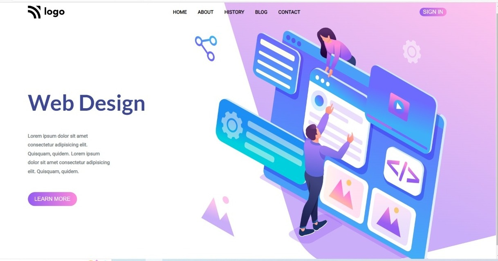

# Assignment-8 
## (Web-designing Home Page) 

> In this project, I have used HTML (the Hypertext Markup Language) and CSS (Cascading Style Sheets), which are two of the core technologies for building Web pages. It is a static and non-responsive page.

### As a result of this project, I learn the following:
[LIVE-LINK](https://projectwebdesign.netlify.app/)

- [x] learned about Flexbox
- [x] learned about Position Elements
- [x] design Beautiful Buttons with liner-gredient

#### The duration of the project:3.30 hour